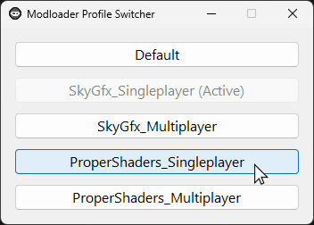

<h1 align="center">Modloader Profile Switcher</h1>

<p align="center">
  Lightweight utility tool to switch active modloader profile
</p>

<p align="center">
  
  
  
  
</p>

___

This is a single-executable tool designed to quickly change the active [Modloader](https://github.com/thelink2012/modloader) profile in Grand Theft Auto: San Andreas. It's built in Rust and utilizes the native Windows GUI bindings. It is incredibly lightweight (~1.2 MB) and requires no external dependencies or runtimes.

## How It Works

- It automatically reads your `modloader/modloader.ini` configuration, detects all available profiles, and displays them in a minimal interface.
- Re-writes the active profile configuration in-place. It safely preserves all original comments, alignment, and formatting within the file.

<p align="center">
  
</p>

## Installation & Usage

1. **Download**: Obtain the latest `ProfileSwitcher.exe` from the [Releases](#) page.
2. **Install**: Drop the executable directly into your Grand Theft Auto root directory (the same folder containing game's `.exe` and your `modloader` folder).
3. **Run**: Launch `ProfileSwitcher.exe`. Select your desired profile, and the configuration will instantly be updated.

## Building from Source

To compile the application yourself, you will need the [Rust toolchain](https://rustup.rs/) installed on your Windows machine.

1. Clone the repository:
   ```bash
   git clone https://github.com/yourusername/modloader-profile-switcher.git
   cd modloader-profile-switcher
   ```

2. Compile the release executable:
   ```bash
   cargo build --release
   ```

3. Locate the compiled executable:
   The standalone binary will be generated at `target/release/ProfileSwitcher.exe`.

## License

This project is distributed under the MIT License. See `LICENSE` for further details.
